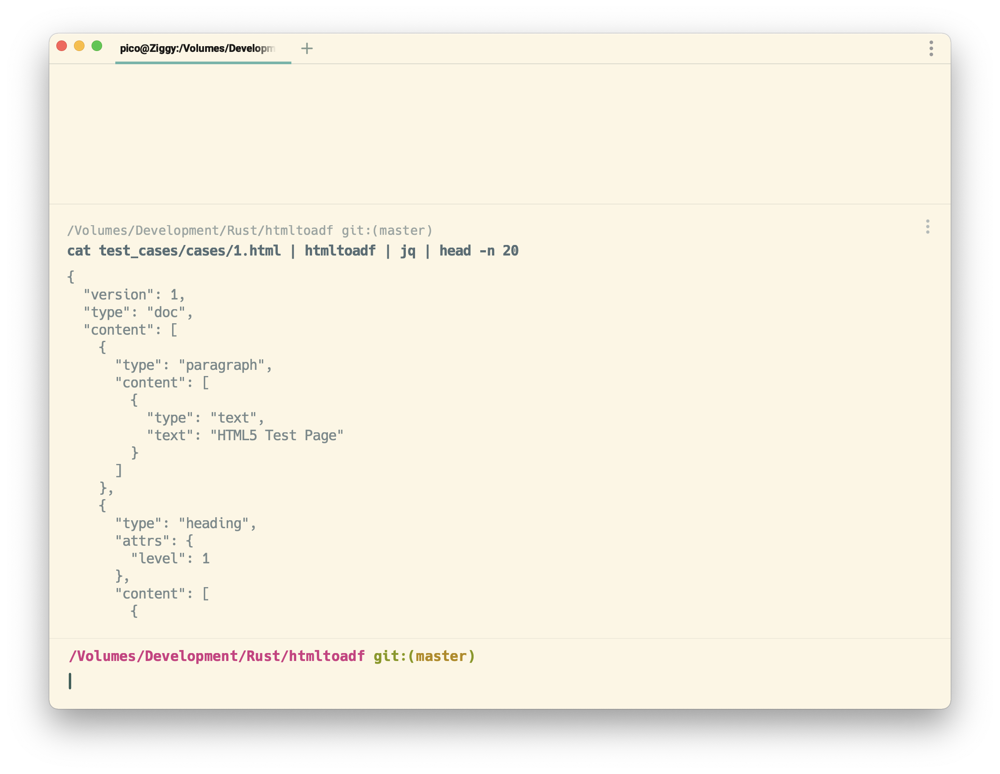
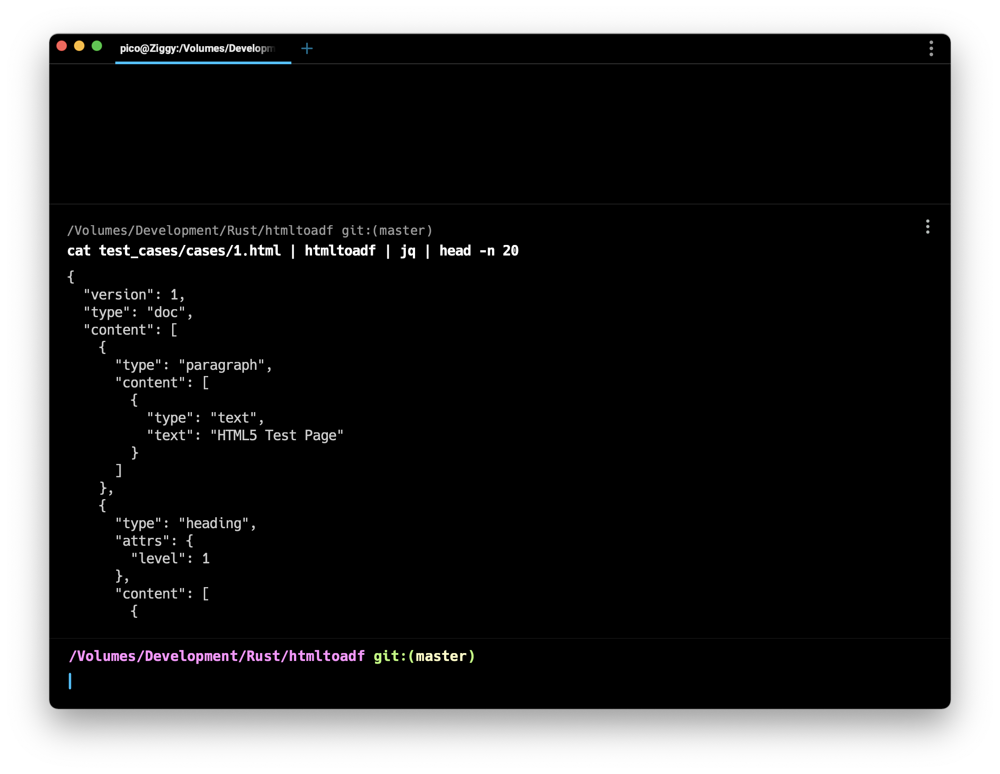

# htmltoadf [![Latest Version]][crates.io] [![Rustc Version 1.58+]][rustc] ![htmltoadf]

[Latest Version]: https://img.shields.io/crates/v/htmltoadf.svg
[crates.io]: https://crates.io/crates/htmltoadf
[Rustc Version 1.58+]: https://img.shields.io/badge/rustc-1.58+-lightgray.svg
[rustc]: https://blog.rust-lang.org/2022/01/13/Rust-1.58.0.html
[htmltoadf]: https://img.shields.io/badge/htmltoadf--green.svg

**htmltoadf is an HTML to Atlassian Document Format (ADF) converter written in Rust.**

The library can be used in several different ways:
* As a command line binary (either directly on a compatible host or using Docker)
* Included as a library within a Rust project
* Called from a different language or environment (e.g. C, JavaScript, Ruby, PHP, .NET etc.) using [FFI](https://doc.rust-lang.org/nomicon/ffi.html)
* Called as a Web Assembly (wasm) module

----



----
## Demo

See demo of the tool running as a WASM library entirely in the client here:
https://wouterken.github.io/htmltoadf/

----

## CLI
### Binaries

The htmltoadf tool includes an html2adf binary.

#### Usage

```bash
$ html2adf -h
```

```
htmltoadf 0.1.10
An HTML to Atlassian Document Format (ADF) converter

USAGE:
    html2adf [OPTIONS] [INPATH]

ARGS:
    <INPATH>    The path to the file to read

OPTIONS:
    -h, --help                 Print help information
    -o, --outpath <OUTPATH>
    -V, --version              Print version information
```

### Install Binary from Crates.io with `cargo install`
```
$ cargo install htmltoadf
    installing htmltoadf v0.1.10 (/usr/src/html2adf)
    Updating crates.io index
 Downloading crates ...
  Downloaded lock_api v0.4.6
--snip--
      Compiling htmltoadf v0.1.10
    Finished release [optimized] target(s) in 1m 42s
  Installing ~/.cargo/bin/htmltoadf
   Installed package `htmltoadf v0.1.10` (executable `html2adf`)
```

### Download Binary file from Github
Pre-built binaries can be downloaded from here:
https://github.com/wouterken/htmltoadf/releases/tag/0.1.10

### Docker Image
**Docker Repo:**

https://hub.docker.com/r/wouterken/html2adf

**Usage**

```bash
$ echo "<h1>Hello world<p>Test</p></h1>" | docker run --rm -i wouterken/html2adf:0.1.10
{"version":1,"type":"doc","content":[{"type":"heading","attrs":{"level":1},"content":[{"type":"text","text":"Hello world"},{"type":"text","text":"Test"}]}]}

$ echo "<h1>Hello world<p>Test</p></h1>" | docker run --rm -i wouterken/html2adf:0.1.10 | jq
{
  "version": 1,
  "type": "doc",
  "content": [
    {
      "type": "heading",
      "attrs": {
        "level": 1
      },
      "content": [
        {
          "type": "text",
          "text": "Hello world"
        },
        {
          "type": "text",
          "text": "Test"
        }
      ]
    }
  ]
}
```

## Lib

### Example Rust Code

**Cargo.toml**

```toml
[dependencies]
htmltoadf = "0.1.10"
```

**Code**

```rust
use htmltoadf::convert_html_str_to_adf_str;
use serde_json::json;

let converted = convert_html_str_to_adf_str("<h1>Hello World</h1>".to_string());
let expected = json!({
    "version": 1,
    "type": "doc",
    "content": [
        {
            "type": "heading",
            "attrs": {
                "level": 1
            },
            "content": [
                {
                    "type": "text",
                    "text": "Hello World"
                }
            ]
        }
    ]
}).to_string();

assert_eq!(expected, converted);
```

### WASM

Install package from [npm](https://www.npmjs.com/package/htmltoadf)

```javascript
import init, {convert} from "htmltoadf";
init()
  .then(() => {
    alert(convert("<h1>Hello from WebAssembly</h1>"))
  });
```

### FFI
First compile the code as a library, e.g.:

```bash
cargo build --lib --release
```

Then you can link to the library dynamic from any environment that supports a FFI.
**It is important to copy the dynamic library from the release directory, and provide a relative link to the library file from the FFI**


E.g.

#### Ruby
```ruby
require 'ffi'

module HTMLToADF
  extend FFI::Library
  ffi_lib 'libhtmltoadf'
  attach_function :convert, [ :string ], :string
end

puts HTMLToADF.convert("<h1>Hello from Ruby</h1>")
```

#### Node/JavaScript
```javascript
var ffi = require('ffi-napi');

var htmltoadf = ffi.Library('libhtmltoadf', {
  'convert': [ 'string', [ 'string' ] ]
});
console.log(htmltoadf.convert("<h1>Hello from Node!</h1>"));

```

#### Python
```python
from cffi import FFI
ffi = FFI()
lib = ffi.dlopen("libhtmltoadf")
ffi.cdef("char * convert(char *);")
print(ffi.string(lib.convert(b"<h1>Hello from Python!</h1>")))

```

## Implemented features
This converter only implements a subset of possible mappings between HTML and ADF.
The following features are implemented:
- [x] Headings
- [x] Images
- [x] Lists (ordered and unordered)
- [x] Tables
- [x] Text and Paragraphs
- [x] Code
- [ ] Fuzz Tests
- [ ] Support for named CSS colors
- [ ] Smart image sizing
- [ ] Inline Cards
- [ ] Panels
- [ ] Emoji
- [ ] In built JSON Schema Validation

## Release Process
* Increment version number in .toml and README
* Compile binaries and create release
* Build and push Docker image
* Build and push WASM NPM package
* Push crate
* Update dependency in demo page
* Push to VCS

## Testing
Run `cargo test` from the repository root.

## Contributing

Bug reports and pull requests are welcome on GitHub at https://github.com/wouterken/htmltoadf. This project is intended to be a safe, welcoming space for collaboration, and contributors are expected to adhere to the [Contributor Covenant](http://contributor-covenant.org) code of conduct.
